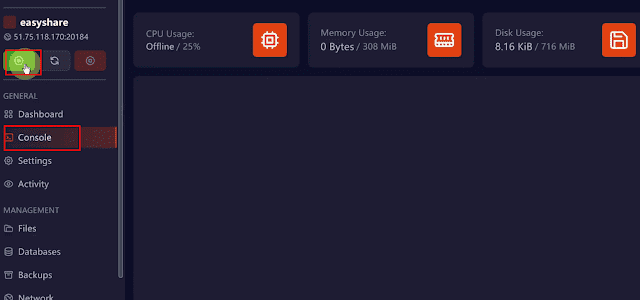
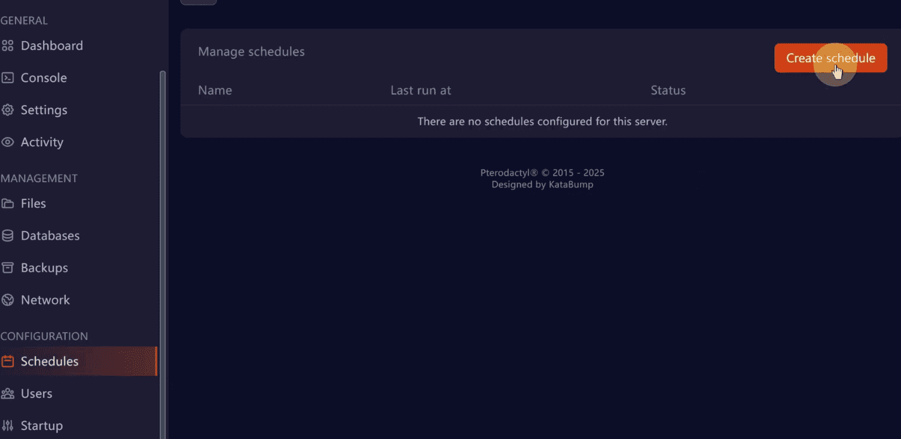
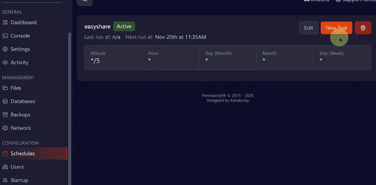

# 免费主机搭建高速节点完整教程

## 📌 项目简介

本教程将手把手教你使用 **Katabump 免费主机**，零基础搭建高性能代理节点。支持 TUIC、Hysteria2、Vless Reality 等多种协议，实测 YouTube 晚高峰 4K 秒开，完美解锁流媒体、Netflix、ChatGPT。

### ✨ 核心特性

- 🆓 **完全免费** - 永久免费主机，无需付费
- ⚡ **高速稳定** - 晚高峰 4K 视频秒开
- 🔓 **全面解锁** - Netflix、ChatGPT 等流媒体完美支持
- 💾 **无限流量** - 不限制流量使用
- 🔄 **自动保活** - 配置后自动续期，无需手动维护

### 🔗 资源链接

- **免费主机注册**：[Katabump Dashboard](https://dashboard.katabump.com/auth/login)
- **项目源码**：[GitHub - Singbox-nodejs](https://github.com/eishare/Singbox-nodejs)
- **GitHub 访问加速**：[Steamcommunity 302](https://www.dogfight360.com/blog/18682/)

---

## 🎥 视频教程

<iframe 
  width="100%" 
  height="450" 
  src="https://www.youtube.com/embed/4hcCSh5kxKk" 
  frameborder="0" 
  allow="accelerometer; autoplay; clipboard-write; encrypted-media; gyroscope; picture-in-picture" 
  allowfullscreen>
</iframe>

---

## 🚀 搭建步骤

### 步骤 1：创建 Nodejs 项目

登录 Katabump 后台，选择创建 **Nodejs** 类型的项目。

---

### 步骤 2：记录端口号

进入 **Network** 选项卡，记录下分配的 **Port（端口号）**，后续配置需要用到。

---

### 步骤 3：创建配置文件

进入 **Files** 选项卡，创建以下 3 个文件（文件内容从 [GitHub 项目](https://github.com/eishare/Singbox-nodejs) 获取）：

1. `index.js` - 主程序文件
2. `package.json` - 依赖配置
3. `start.sh` - 启动脚本

:::tip 提示
无法访问 GitHub？可以使用 [Steamcommunity 302](https://www.dogfight360.com/blog/18682/) 加速访问，无需梯子即可访问 GitHub。
:::

---

### 步骤 4：配置端口号

编辑 `start.sh` 文件，在以下位置填入刚才记录的端口号：

- **第 5 行**：TUIC 协议端口
- **第 7 行**：Reality 协议端口

---

### 步骤 5：启动主机

进入 **Console** 选项卡，点击启动按钮开启主机。

---

### 步骤 6：获取节点信息

启动成功后，复制生成的节点信息，导入到你的代理软件（如 Clash、V2rayN 等）即可开始使用。

---

## ⚙️ 配置自动保活

为了保证主机不会因为空闲而被暂停，需要配置自动保活任务。

### 步骤 1：创建 Schedule

点击 **Schedules** → **Create Schedule**。

---

### 步骤 2：自定义名称

输入任务名称（如 "Auto Keep Alive"），然后保存。

---

### 步骤 3：管理 Schedule

点击 **Manage schedule** 进入任务管理界面。

---

### 步骤 4：创建任务

点击 **New Task** 创建新的保活任务。

---

### 步骤 5：配置电源操作

选择 **Send power action**，开启保活选项，然后保存即可。

---

## 🎉 完成

恭喜！你已经成功搭建了自己的高速节点，现在可以：

- ✅ 流畅观看 YouTube 4K 视频
- ✅ 解锁 Netflix、Disney+ 等流媒体
- ✅ 正常使用 ChatGPT
- ✅ 享受稳定的网络连接

:::info 注意事项
- 定期检查主机运行状态
- 如遇问题可查看 Console 日志排查
- 建议备份节点配置信息
:::
