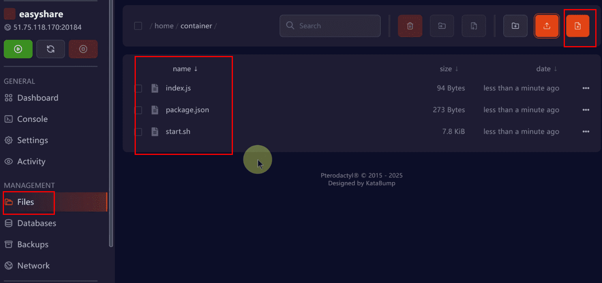
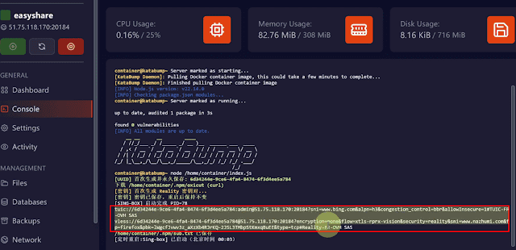

```js
 // 设置侧边栏展开/收缩功能（桌面端和移动端）栏展开/收缩功能（桌面端和移动端）栏展开/收缩功能（桌面端和移动端）栏展开/收缩功能（桌面端和移动端）栏展开/收缩功能（桌面端和移动端）
function setupSidebarToggle() {
    const bindToggle = (container) => {
        if (!container || container.dataset.toggleBound === 'true') {
            return;
        }
        
        container.addEventListener('click', (event) => {
            const title = event.target.closest('.sidebar-group-title');
            if (!title || !container.contains(title)) {
                return;
            }
            
            const items = title.nextElementSibling;
            title.classList.toggle('collapsed');
            
            if (items && items.classList.contains('sidebar-group-items')) {
                items.classList.toggle('collapsed');
            }
        });
        
        container.dataset.toggleBound = 'true';
    };
    
    bindToggle(document.querySelector('.sidebar'));
    bindToggle(document.querySelector('.sider-container'));
}
```

# 白嫖永久免费主机，小白零基础一键搭建 TUIC+hysteria2+Vless reality高速节点！无限流量！先到先得！实测YouTube晚高峰4K秒开，流媒体 奈飞 chatgpt完美解锁 |Katabump免费续期！自动保活


[免费主机：【点击注册】](https://dashboard.katabump.com/auth/login)

[项目地址：【点击访问】](https://github.com/eishare/Singbox-nodejs)


选择Nodejs


进入Network记录端口Port


进入Files创建3个文件index.js/package.json/start.sh （文件内容在Github项目里面）
[Github地址：【点击访问】](https://github.com/eishare/Singbox-nodejs)
无法访问Github？你可以使用 [Steamcommunity 302](https://www.dogfight360.com/blog/18682/) 加速访问（这是不需要梯子可以访问Github的，有梯子那还说啥干就完事了，免费节点过渡的也可以直接使用）



在start.sh文件第5行TUIC协议和第7行reality协议填上端口


进入Console开启主机


复制节点导入代理软件进行翻墙



进行保活
点击Schedules点击Create Schedule


自定义名称然后保存


点击Manage schedule


点击New Task


选择Send power action 然后开启选项，然后保存


